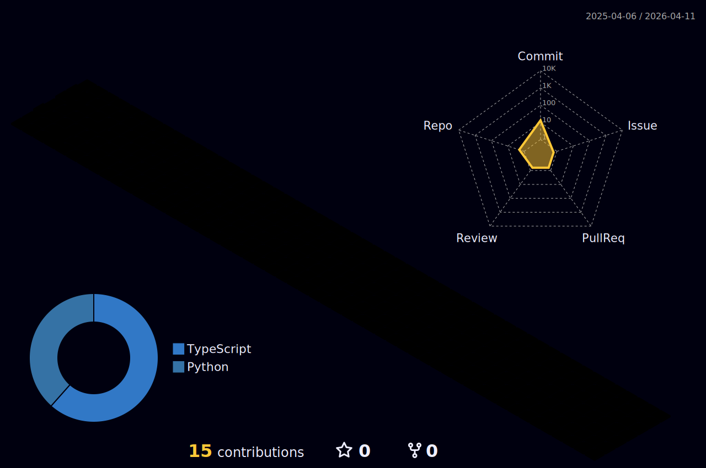

# 💫 About Me:
👋 Hi there! I'm a passionate student 🎓 on an exciting journey of exploration 🌟. Currently, I'm diving into the world of coding 🖥️ and immersing myself in the realms of C, Python, HTML, CSS, Java, and JavaScript. 🌐✨   I love the thrill of learning new languages and technologies, and I'm constantly expanding my skills to build amazing things! 💪🚀   Passionate about coding and creating, I thrive in the realm of technology, always seeking new challenges to conquer! 💻💡   Let's collaborate, innovate, and make the digital world a better place together! 🌍✨   Feel free to reach out at jainra_1@rknec.edu and let's geek out over the incredible possibilities of technology! 🚀 
## 🌐 Socials:
     
# 💻 Tech Stack:
                    
# 📊 GitHub Stats:
 
 

## 🏆 GitHub Trophies

### ✍️ Random Dev Quote

---

<!-- Proudly created with GPRM ( https://gprm.itsvg.in ) -->
